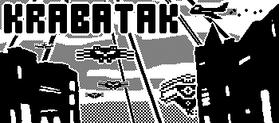

# KRABATAK

To learn Playdate dev, I'm supercharging the game I built to learn Pico 8, [Save Picoville](https://www.lexaloffle.com/bbs/?tid=54775). Originally called Save Playville, I'm now toying with KRABATAK. ¯\_(ツ)_/¯

Still very much an organic work-in-progress. I started in a more chunky, mechanical, minimal animation style, but am starting to flesh out more hand-drawn, animated enemies. Similarly, I ported over all my sounds and music that I crafted in Pico 8's very fun built-in tools, but am starting to add more real sound samples. Not entirely sure if everything is meshing.

I have serious nostalgia for the 1-bit classic Mac games, which is surely affecting my visual + sound choices. I recently watched some longplay Crystal Quest videos and confirmed this theory.

I've had to dig in and optimize a few times to keep this running somewhat smoothly at 30fps, and am again running into issues with too many sprites as levels progress and I keep adding new enemies, especially ones that shoot multiple bullets. Though I keep finding things I'm doing things in a backwards fashion, so as I learn more Lua and Playdate SDK, maybe I'll be able to avoid any drastic refactoring.

It's funny that I felt the need to rewrite all my manual collision detection and procedural setup from Pico 8, into a more object-oriented approach using built-ins from the Playdate SDK. But as soon as I start running into a performance ceiling, I find people saying it's more efficient to use exactly what I tore apart to make my code more "proper." Oof.
